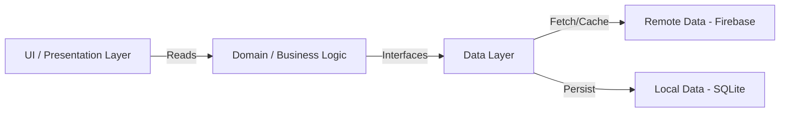

# 🛠️ KareebWala (قریب والا)
> **Bridging the gap between local experts and urgent needs.**

[](https://flutter.dev)
[](https://dart.dev)
[](https://firebase.google.com)
[](https://riverpod.dev)
[](LICENSE)

---

## 📖 Table of Contents
- [About the Project](#-about-the-project)
- [✨ Key Features](#-key-features)
- [📱 Interface & Demo](#-interface--demo)
- [⚙️ Technical Architecture](#️-technical-architecture)
- [🛠️ Tech Stack](#️-tech-stack)
- [🚀 Installation & Setup](#-installation--setup)
- [📂 Folder Structure](#-folder-structure)
- [🔮 Future Roadmap](#-future-roadmap)
- [🤝 Contributing](#-contributing)
- [📄 License](#-license)
- [👨‍💻 Author](#-author)

---

## 💡 About the Project

**KareebWala** is a hyperlocal, on-demand service marketplace designed to connect users with nearby service providers (Mechanics, Electricians, Plumbers) instantly. 

Unlike traditional directories, KareebWala offers **real-time geospatial tracking**, enabling users to see providers moving on the map, estimate arrival times, and book services with a single tap. It employs a **Hybrid Database approach (Online + Offline)** ensuring that booking history remains accessible even without an internet connection.

### 🎯 Problem Statement
Finding reliable local service providers during emergencies is time-consuming and frustrating. Most platforms lack real-time tracking and offline capabilities. 

### 💡 Our Solution
KareebWala provides instant connectivity with verified local experts through: 
- Real-time location tracking
- Offline booking history
- Emergency SOS mode
- Transparent pricing

---

## ✨ Key Features

### 👤 User Module (Client)
* **📍 Geo-Fencing & Live Tracking:** Real-time visibility of available providers within a specific radius. 
* **⚡ Instant Booking:** Seamless request flow with automatic price estimation based on service type.
* **🆘 SOS Emergency Mode:** A dedicated high-priority channel for urgent situations (e.g., car breakdown at night).
* **🔐 Secure Authentication:** Role-based login via Email & Google Sign-In. 
* **📂 Offline Mode:** "My Bookings" history is cached locally using SQLite, accessible 24/7.
* **📊 Service History:** Complete record of past bookings with ratings and feedback. 
* **💰 Transparent Pricing:** Upfront cost estimation before booking confirmation.

### 🛠️ Provider Module (Expert)
* **📟 Live Dashboard:** A dedicated command center receiving job requests in real-time via Streams.
* **📏 Smart Distance Calculation:** Calculates the exact Haversine distance to the client before accepting a job.
* **✅ Lifecycle Management:** Complete control over job status (Accept → Arrive → Complete).
* **💼 Profile Management:** Manage availability, service portfolio, and pricing. 
* **📈 Earnings Tracker:** Monitor daily and monthly income. 
* **⭐ Rating System:** Build reputation through customer reviews. 

---

## 📱 Interface & Demo

| **Onboarding** | **Home Map** | **Request Service** | **Live Tracking** |
|:---:|:---:|:---:|: ---:|
|  |  |  |  |

### 🎥 Demo Video
> Add a link to your demo video here (YouTube, Google Drive, etc.)

---

## ⚙️ Technical Architecture

This project strictly adheres to **Clean Architecture** combined with **Feature-First** directory structure. This ensures the codebase is scalable, testable, and easy to maintain.



### Architecture Layers
1. **Presentation Layer**: Widgets, Screens, UI Components (Riverpod State Management)
2. **Domain Layer**: Business Logic, Use Cases, Entities
3. **Data Layer**:  Repositories, Data Sources (Remote + Local)

### Key Design Patterns
- **Repository Pattern**: Abstraction between data sources and business logic
- **Provider Pattern**: Riverpod for dependency injection and state management
- **Stream Pattern**: Real-time data synchronization with Firestore
- **Singleton Pattern**: Database and service instances

---

## 🛠️ Tech Stack

| Component | Technology | Description |
|-----------|-----------|-------------|
| **Frontend** | Flutter (Dart) | Cross-platform UI toolkit |
| **Backend** | Firebase Firestore | NoSQL Real-time Database |
| **Authentication** | Firebase Auth | Email & Google OAuth |
| **Local DB** | SQLite (SQflite) | SQL database for offline caching |
| **Maps** | Google Maps SDK | Rendering maps & markers |
| **Location** | Geolocator | GPS & Geocoding services |
| **State Management** | Flutter Riverpod | Reactive, type-safe state management |
| **Preferences** | Shared Preferences | Persisting simple flags (Onboarding) |

### Key Dependencies
```yaml
dependencies:
  flutter: 
    sdk: flutter
  firebase_core: ^latest
  firebase_auth: ^latest
  cloud_firestore: ^latest
  google_maps_flutter: ^latest
  geolocator: ^latest
  sqflite: ^latest
  flutter_riverpod: ^latest
  google_sign_in: ^latest
  shared_preferences: ^latest
```

---

## 🚀 Installation & Setup

Follow these steps to run the project locally. 

### Prerequisites
- Flutter SDK installed (v3.0 or higher) - [Install Flutter](https://flutter.dev/docs/get-started/install)
- Android Studio / VS Code set up
- A physical device or emulator
- Firebase account - [Create Firebase Project](https://console.firebase.google.com/)
- Google Maps API key - [Get API Key](https://console.cloud.google.com/)

### Steps

#### 1️⃣ Clone the Repository
```bash
git clone https://github.com/mubasharghazi/kareebwala.git
cd kareebwala
```

#### 2️⃣ Install Dependencies
```bash
flutter pub get
```

#### 3️⃣ Configure Firebase
1. Create a project on [Firebase Console](https://console.firebase.google.com/)
2. Enable **Authentication** (Email/Password & Google)
3. Enable **Firestore Database**
4. Run the following command to link Firebase to your project:
```bash
flutterfire configure
```

#### 4️⃣ Google Maps API Key
1. Get an API Key from [Google Cloud Console](https://console.cloud.google.com/)
2. Enable **Maps SDK for Android** and **Maps SDK for iOS**
3. Add the key to: 

**Android:** `android/app/src/main/AndroidManifest.xml`
```xml
<meta-data
    android:name="com.google.android.geo.API_KEY"
    android:value="YOUR_API_KEY_HERE"/>
```

**iOS:** `ios/Runner/AppDelegate.swift`
```swift
GMSServices.provideAPIKey("YOUR_API_KEY_HERE")
```

#### 5️⃣ Run the App
```bash
flutter run
```

---

## 📂 Folder Structure

```plaintext
lib/
├── core/                   # Common utilities
│   ├── theme/              # App theme and styling
│   ├── utils/              # Helper functions
│   └── services/           # Storage and common services
├── features/               # Feature-based modules
│   ├── auth/               # Login, Signup, User Service
│   │   ├── data/           # Auth repositories
│   │   ├── domain/         # Auth business logic
│   │   └── presentation/   # Auth UI screens
│   ├── booking/            # Request, Tracking, History Logic
│   ├── home_map/           # Main Map Interface
│   ├── provider/           # Provider Dashboard
│   └── onboarding/         # Intro Screens
├── main.dart               # Entry point
└── firebase_options.dart   # Auto-generated Firebase Config
```

---

## 🔮 Future Roadmap

- [ ] **In-App Chat**: Real-time messaging between Client and Provider
- [ ] **Push Notifications**: FCM integration for status updates
- [ ] **Payment Gateway**: Stripe/JazzCash/EasyPaisa integration
- [ ] **Admin Panel**: Web-based panel for managing users and services
- [ ] **Rating & Reviews**: Enhanced feedback system with photos
- [ ] **Multi-language Support**:  Urdu, Punjabi, English
- [ ] **Service Categories**: Expand to more service types
- [ ] **Scheduled Bookings**: Pre-book services for later
- [ ] **Promotional Codes**: Discount and referral system
- [ ] **Analytics Dashboard**: Insights for providers

---

## 🤝 Contributing

Contributions are welcome! Please follow these steps: 

1. Fork the Project
2. Create your Feature Branch (`git checkout -b feature/AmazingFeature`)
3. Commit your Changes (`git commit -m 'Add some AmazingFeature'`)
4. Push to the Branch (`git push origin feature/AmazingFeature`)
5. Open a Pull Request

---

## 📄 License

Distributed under the MIT License. See `LICENSE` file for more information.

---

## 👨‍💻 Author

**Mubashar Ghazi**  
🚀 Flutter Developer | Cloud Enthusiast | Problem Solver

- 🐙 GitHub: [@mubasharghazi](https://github.com/mubasharghazi)
- 💼 LinkedIn: [Connect with me](https://linkedin.com/in/mubasharghazi)
- 📧 Email: mubashar@example.com
- 🎓 University: Riphah International University, Lahore

---

## 🙏 Acknowledgments

- [Flutter Documentation](https://flutter.dev/docs)
- [Firebase Documentation](https://firebase.google.com/docs)
- [Riverpod Documentation](https://riverpod.dev/)
- [Google Maps Flutter Plugin](https://pub.dev/packages/google_maps_flutter)

---

<div align="center">

### ⭐ If you find this project helpful, please give it a star! ⭐

**Made with ❤️ in Pakistan 🇵🇰**

</div>
